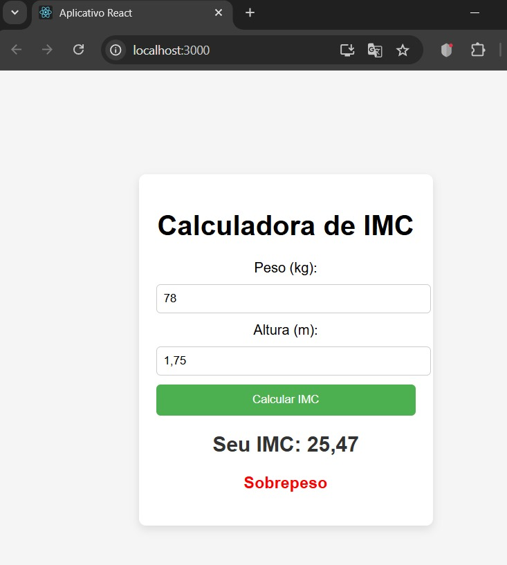

# 🧮 IMC App - Calculadora de Índice de Massa Corporal

Este é um aplicativo simples feito em **React** para calcular o **IMC (Índice de Massa Corporal)** de uma pessoa. O IMC é uma das principais formas de avaliar se alguém está abaixo, dentro ou acima do peso ideal, sendo fundamental para o acompanhamento da saúde.

> ⚠️ **Nota:** Este projeto foi desenvolvido originalmente em **2024**, mas acabei esquecendo de anexar ele aqui no GitHub. Agora estou organizando meus repositórios e subindo todos os projetos que já fiz. É sempre bom manter tudo documentado e salvo por aqui!

---

## 📸 Demonstração

---

## 🚀 Como rodar o projeto

### 1. Acesse a pasta do projeto

cd imc-app
### 3. Instale as dependências
npm install
### 4. Rode o app
npm start

✨ Tecnologias utilizadas
React
CSS
Javascript

🧠 Como funciona
O usuário insere o peso e a altura.

O app calcula o IMC com a fórmula:

IMC = peso / (altura * altura)

O resultado é exibido junto com a classificação do IMC:
Abaixo do peso
Peso ideal
Sobrepeso
Obesidade grau I, II ou III.
